# Advanced CRM System Design

## Overview

The Advanced CRM System is designed as a comprehensive customer relationship management platform that seamlessly integrates with the existing multi-channel ticketing system. It leverages the current infrastructure including Prisma database, Kafka event streaming, AI services, and multi-channel communication adapters to provide a unified view of customer interactions and drive business growth.

## Architecture

### High-Level Architecture

```mermaid
graph TB
    subgraph "Frontend Layer"
        CRM[CRM Dashboard]
        Mobile[Mobile CRM App]
        API[REST API Gateway]
    end
    
    subgraph "Application Layer"
        CRMService[CRM Core Service]
        LeadService[Lead Management]
        DealService[Deal Pipeline]
        SegmentService[Customer Segmentation]
        AnalyticsService[CRM Analytics]
        WorkflowService[CRM Workflows]
    end
    
    subgraph "AI & Intelligence Layer"
        LeadScoring[Lead Scoring AI]
        ChurnPrediction[Churn Prediction]
        SalesCoaching[Sales Coaching AI]
        InsightsEngine[Customer Insights]
    end
    
    subgraph "Integration Layer"
        TicketIntegration[Ticket System Integration]
        ConversationIntegration[Conversation Integration]
        ExternalAPIs[External CRM APIs]
        WebhookManager[Webhook Manager]
    end
    
    subgraph "Data Layer"
        CRMDatabase[(CRM Database)]
        EventStore[(Event Store)]
        AnalyticsDB[(Analytics DB)]
        FileStorage[(File Storage)]
    end
    
    subgraph "Infrastructure"
        EventBus[Kafka Event Bus]
        Cache[Redis Cache]
        Queue[Job Queue]
        Monitoring[Monitoring & Logging]
    end
    
    CRM --> API
    Mobile --> API
    API --> CRMService
    API --> LeadService
    API --> DealService
    API --> SegmentService
    API --> AnalyticsService
    API --> WorkflowService
    
    CRMService --> LeadScoring
    CRMService --> ChurnPrediction
    LeadService --> SalesCoaching
    AnalyticsService --> InsightsEngine
    
    CRMService --> TicketIntegration
    CRMService --> ConversationIntegration
    CRMService --> ExternalAPIs
    CRMService --> WebhookManager
    
    CRMService --> CRMDatabase
    AnalyticsService --> AnalyticsDB
    WorkflowService --> EventStore
    
    CRMService --> EventBus
    CRMService --> Cache
    WorkflowService --> Queue
```



### Database Schema Extensions

Building upon the existing Prisma schema, we'll add the following CRM-specific models:

#### Lead Management Models
```prisma
model Lead {
  id                String              @id @default(cuid())
  tenantId          String
  customerId        String?             // Link to existing customer if converted
  email             String
  firstName         String?
  lastName          String?
  company           String?
  phone             String?
  source            String              // website, referral, campaign, etc.
  status            LeadStatus          @default(NEW)
  score             Int                 @default(0)
  scoreReason       Json?               // AI scoring explanation
  assignedUserId    String?
  tags              String[]            @default([])
  customFields      Json                @default("{}")
  lastActivityAt    DateTime?
  convertedAt       DateTime?
  createdAt         DateTime            @default(now())
  updatedAt         DateTime            @updatedAt
  
  tenant            Tenant              @relation(fields: [tenantId], references: [id], onDelete: Cascade)
  customer          Customer?           @relation(fields: [customerId], references: [id])
  assignedUser      User?               @relation(fields: [assignedUserId], references: [id])
  activities        LeadActivity[]
  deals             Deal[]
  
  @@index([tenantId, status])
  @@index([tenantId, score])
  @@index([tenantId, assignedUserId])
  @@map("leads")
}

model LeadActivity {
  id          String              @id @default(cuid())
  leadId      String
  userId      String?
  type        LeadActivityType
  description String
  metadata    Json                @default("{}")
  createdAt   DateTime            @default(now())
  
  lead        Lead                @relation(fields: [leadId], references: [id], onDelete: Cascade)
  user        User?               @relation(fields: [userId], references: [id])
  
  @@index([leadId, createdAt])
  @@map("lead_activities")
}

enum LeadStatus {
  NEW
  CONTACTED
  QUALIFIED
  PROPOSAL
  NEGOTIATION
  CONVERTED
  LOST
}

enum LeadActivityType {
  EMAIL_SENT
  EMAIL_OPENED
  EMAIL_CLICKED
  CALL_MADE
  CALL_ANSWERED
  MEETING_SCHEDULED
  MEETING_COMPLETED
  FORM_SUBMITTED
  WEBSITE_VISIT
  DOCUMENT_VIEWED
  PROPOSAL_SENT
  CONTRACT_SENT
  NOTE_ADDED
}
```

#### Deal Management Models
```prisma
model Deal {
  id                String              @id @default(cuid())
  tenantId          String
  leadId            String?
  customerId        String?
  name              String
  description       String?
  value             Decimal
  currency          String              @default("USD")
  probability       Int                 @default(50) // 0-100
  stage             String
  pipelineId        String
  assignedUserId    String?
  expectedCloseDate DateTime?
  actualCloseDate   DateTime?
  lostReason        String?
  tags              String[]            @default([])
  customFields      Json                @default("{}")
  createdAt         DateTime            @default(now())
  updatedAt         DateTime            @updatedAt
  
  tenant            Tenant              @relation(fields: [tenantId], references: [id], onDelete: Cascade)
  lead              Lead?               @relation(fields: [leadId], references: [id])
  customer          Customer?           @relation(fields: [customerId], references: [id])
  pipeline          SalesPipeline       @relation(fields: [pipelineId], references: [id])
  assignedUser      User?               @relation(fields: [assignedUserId], references: [id])
  activities        DealActivity[]
  products          DealProduct[]
  
  @@index([tenantId, stage])
  @@index([tenantId, assignedUserId])
  @@index([tenantId, expectedCloseDate])
  @@map("deals")
}

model SalesPipeline {
  id          String              @id @default(cuid())
  tenantId    String
  name        String
  description String?
  stages      Json                // Array of stage definitions
  isDefault   Boolean             @default(false)
  isActive    Boolean             @default(true)
  createdAt   DateTime            @default(now())
  updatedAt   DateTime            @updatedAt
  
  tenant      Tenant              @relation(fields: [tenantId], references: [id], onDelete: Cascade)
  deals       Deal[]
  
  @@unique([tenantId, name])
  @@map("sales_pipelines")
}

model DealActivity {
  id          String              @id @default(cuid())
  dealId      String
  userId      String?
  type        DealActivityType
  description String
  metadata    Json                @default("{}")
  createdAt   DateTime            @default(now())
  
  deal        Deal                @relation(fields: [dealId], references: [id], onDelete: Cascade)
  user        User?               @relation(fields: [userId], references: [id])
  
  @@index([dealId, createdAt])
  @@map("deal_activities")
}

model DealProduct {
  id          String              @id @default(cuid())
  dealId      String
  productId   String
  quantity    Int                 @default(1)
  unitPrice   Decimal
  discount    Decimal             @default(0)
  totalPrice  Decimal
  
  deal        Deal                @relation(fields: [dealId], references: [id], onDelete: Cascade)
  product     Product             @relation(fields: [productId], references: [id])
  
  @@unique([dealId, productId])
  @@map("deal_products")
}

enum DealActivityType {
  CREATED
  STAGE_CHANGED
  VALUE_UPDATED
  PROBABILITY_CHANGED
  ASSIGNED
  NOTE_ADDED
  EMAIL_SENT
  CALL_MADE
  MEETING_SCHEDULED
  PROPOSAL_SENT
  CONTRACT_SENT
  WON
  LOST
}
```

#### Customer Segmentation Models
```prisma
model CustomerSegment {
  id              String              @id @default(cuid())
  tenantId        String
  name            String
  description     String?
  criteria        Json                // Segmentation rules
  isActive        Boolean             @default(true)
  isDynamic       Boolean             @default(true)
  customerCount   Int                 @default(0)
  lastCalculated  DateTime?
  createdAt       DateTime            @default(now())
  updatedAt       DateTime            @updatedAt
  
  tenant          Tenant              @relation(fields: [tenantId], references: [id], onDelete: Cascade)
  memberships     CustomerSegmentMembership[]
  campaigns       MarketingCampaign[]
  
  @@unique([tenantId, name])
  @@map("customer_segments")
}

model CustomerSegmentMembership {
  id          String              @id @default(cuid())
  segmentId   String
  customerId  String
  addedAt     DateTime            @default(now())
  
  segment     CustomerSegment     @relation(fields: [segmentId], references: [id], onDelete: Cascade)
  customer    Customer            @relation(fields: [customerId], references: [id], onDelete: Cascade)
  
  @@unique([segmentId, customerId])
  @@map("customer_segment_memberships")
}
```

#### Product Catalog Models
```prisma
model Product {
  id              String              @id @default(cuid())
  tenantId        String
  name            String
  description     String?
  sku             String?
  category        String?
  price           Decimal
  currency        String              @default("USD")
  isActive        Boolean             @default(true)
  metadata        Json                @default("{}")
  createdAt       DateTime            @default(now())
  updatedAt       DateTime            @updatedAt
  
  tenant          Tenant              @relation(fields: [tenantId], references: [id], onDelete: Cascade)
  dealProducts    DealProduct[]
  
  @@unique([tenantId, sku])
  @@map("products")
}
```

#### Marketing Campaign Models
```prisma
model MarketingCampaign {
  id              String              @id @default(cuid())
  tenantId        String
  name            String
  description     String?
  type            CampaignType
  status          CampaignStatus      @default(DRAFT)
  segmentId       String?
  startDate       DateTime?
  endDate         DateTime?
  budget          Decimal?
  spent           Decimal             @default(0)
  metrics         Json                @default("{}")
  createdAt       DateTime            @default(now())
  updatedAt       DateTime            @updatedAt
  
  tenant          Tenant              @relation(fields: [tenantId], references: [id], onDelete: Cascade)
  segment         CustomerSegment?    @relation(fields: [segmentId], references: [id])
  
  @@map("marketing_campaigns")
}

enum CampaignType {
  EMAIL
  SMS
  SOCIAL
  WEBINAR
  CONTENT
  PAID_ADS
}

enum CampaignStatus {
  DRAFT
  SCHEDULED
  ACTIVE
  PAUSED
  COMPLETED
  CANCELLED
}
```

## Components and Interfaces

### Core CRM Service

The main CRM service will orchestrate all CRM operations and maintain consistency with the existing ticketing system.

```typescript
interface CRMService {
  // Lead Management
  createLead(data: CreateLeadDto): Promise<Lead>
  updateLead(id: string, data: UpdateLeadDto): Promise<Lead>
  convertLeadToCustomer(leadId: string): Promise<Customer>
  scoreLeads(tenantId: string): Promise<void>
  
  // Deal Management
  createDeal(data: CreateDealDto): Promise<Deal>
  updateDealStage(dealId: string, stage: string): Promise<Deal>
  calculateDealProbability(dealId: string): Promise<number>
  
  // Customer Lifecycle
  updateCustomerStage(customerId: string, stage: CustomerStage): Promise<void>
  calculateCustomerHealth(customerId: string): Promise<CustomerHealthScore>
  
  // Segmentation
  createSegment(data: CreateSegmentDto): Promise<CustomerSegment>
  calculateSegmentMembership(segmentId: string): Promise<void>
  
  // Analytics
  getDashboardMetrics(tenantId: string): Promise<CRMDashboardMetrics>
  getRevenueAttribution(tenantId: string, dateRange: DateRange): Promise<RevenueAttribution>
}
```

### AI Integration Service

Leveraging the existing AI infrastructure to provide CRM-specific intelligence.

```typescript
interface CRMAIService {
  // Lead Scoring
  calculateLeadScore(lead: Lead, context: LeadScoringContext): Promise<LeadScore>
  explainLeadScore(leadId: string): Promise<ScoreExplanation>
  
  // Churn Prediction
  predictChurn(customerId: string): Promise<ChurnPrediction>
  identifyChurnFactors(customerId: string): Promise<ChurnFactor[]>
  
  // Sales Insights
  analyzeSalesConversation(conversationId: string): Promise<SalesInsights>
  suggestNextBestAction(customerId: string): Promise<NextBestAction[]>
  
  // Revenue Forecasting
  forecastRevenue(pipelineId: string, timeframe: number): Promise<RevenueForecast>
}
```

### Integration Adapters

Building on the existing channel adapters to provide CRM context.

```typescript
interface CRMIntegrationService {
  // Ticket System Integration
  enrichTicketWithCRMData(ticketId: string): Promise<EnrichedTicket>
  createLeadFromTicket(ticketId: string): Promise<Lead>
  
  // Conversation Integration
  extractSalesSignals(conversationId: string): Promise<SalesSignal[]>
  updateDealFromConversation(conversationId: string, dealId: string): Promise<void>
  
  // External CRM Sync
  syncWithExternalCRM(provider: string, config: CRMSyncConfig): Promise<SyncResult>
  
  // Marketing Automation
  triggerCampaign(campaignId: string, customerId: string): Promise<void>
}
```

## Data Models

### Lead Scoring Model

The AI-powered lead scoring system will consider multiple factors:

```typescript
interface LeadScoringContext {
  demographic: {
    company_size?: number
    industry?: string
    job_title?: string
    location?: string
  }
  behavioral: {
    email_opens: number
    email_clicks: number
    website_visits: number
    page_views: number
    form_submissions: number
    content_downloads: number
  }
  engagement: {
    response_time: number
    meeting_acceptance_rate: number
    call_duration: number
    email_replies: number
  }
  firmographic: {
    revenue?: number
    employee_count?: number
    technology_stack?: string[]
    funding_stage?: string
  }
}

interface LeadScore {
  score: number // 0-100
  confidence: number
  factors: ScoreFactor[]
  recommendations: string[]
  nextBestActions: NextBestAction[]
}
```

### Customer Health Score

Building on existing customer data to calculate health scores:

```typescript
interface CustomerHealthScore {
  score: number // 0-100
  trend: 'improving' | 'stable' | 'declining'
  factors: HealthFactor[]
  riskLevel: 'low' | 'medium' | 'high' | 'critical'
  recommendations: string[]
  lastCalculated: Date
}

interface HealthFactor {
  category: 'usage' | 'support' | 'engagement' | 'financial'
  factor: string
  weight: number
  value: number
  impact: 'positive' | 'negative' | 'neutral'
}
```

### Revenue Attribution Model

```typescript
interface RevenueAttribution {
  totalRevenue: number
  attributionModel: 'first-touch' | 'last-touch' | 'multi-touch' | 'time-decay'
  touchpoints: TouchpointAttribution[]
  channels: ChannelAttribution[]
  campaigns: CampaignAttribution[]
  timeframe: DateRange
}

interface TouchpointAttribution {
  touchpointId: string
  type: 'email' | 'call' | 'meeting' | 'demo' | 'proposal' | 'support_ticket'
  attribution: number
  percentage: number
  timestamp: Date
}
```

## Error Handling

### CRM-Specific Error Types

```typescript
enum CRMErrorCode {
  LEAD_NOT_FOUND = 'LEAD_NOT_FOUND',
  DEAL_STAGE_INVALID = 'DEAL_STAGE_INVALID',
  PIPELINE_NOT_FOUND = 'PIPELINE_NOT_FOUND',
  SEGMENT_CALCULATION_FAILED = 'SEGMENT_CALCULATION_FAILED',
  SCORING_SERVICE_UNAVAILABLE = 'SCORING_SERVICE_UNAVAILABLE',
  INTEGRATION_SYNC_FAILED = 'INTEGRATION_SYNC_FAILED',
  REVENUE_CALCULATION_ERROR = 'REVENUE_CALCULATION_ERROR'
}

class CRMError extends Error {
  constructor(
    public code: CRMErrorCode,
    message: string,
    public context?: any
  ) {
    super(message)
    this.name = 'CRMError'
  }
}
```

### Error Recovery Strategies

1. **Lead Scoring Failures**: Fall back to rule-based scoring when AI service is unavailable
2. **Segmentation Errors**: Use cached segment memberships and schedule recalculation
3. **Integration Failures**: Queue sync operations for retry with exponential backoff
4. **Revenue Attribution**: Provide approximate attribution when exact calculation fails

## Testing Strategy

### Unit Testing

- **Service Layer**: Test all CRM business logic with mocked dependencies
- **AI Integration**: Mock AI responses and test error handling
- **Data Models**: Validate Prisma model relationships and constraints
- **Calculations**: Test lead scoring, health scoring, and revenue attribution algorithms

### Integration Testing

- **Database Operations**: Test complex queries and transactions
- **Event Publishing**: Verify Kafka events are published correctly
- **API Endpoints**: Test all CRM REST endpoints with various scenarios
- **External Integrations**: Test webhook handling and external API calls

### End-to-End Testing

- **Lead Lifecycle**: Test complete lead-to-customer conversion flow
- **Deal Pipeline**: Test deal progression through all stages
- **Segmentation**: Test dynamic segment updates based on customer behavior
- **Revenue Attribution**: Test multi-touchpoint revenue attribution scenarios

### Performance Testing

- **Lead Scoring**: Test AI scoring performance with large lead volumes
- **Segmentation**: Test segment calculation performance with complex criteria
- **Dashboard Loading**: Test dashboard performance with large datasets
- **Mobile Sync**: Test mobile app sync performance with offline scenarios

## Security Considerations

### Data Protection

- **PII Encryption**: Encrypt sensitive customer data at rest and in transit
- **Access Controls**: Implement role-based access for CRM data
- **Audit Logging**: Log all CRM data access and modifications
- **Data Retention**: Implement configurable data retention policies

### API Security

- **Authentication**: Extend existing JWT authentication for CRM endpoints
- **Authorization**: Implement fine-grained permissions for CRM operations
- **Rate Limiting**: Apply rate limits to prevent abuse of CRM APIs
- **Input Validation**: Validate all CRM data inputs to prevent injection attacks

### Integration Security

- **Webhook Verification**: Verify webhook signatures from external systems
- **API Key Management**: Securely store and rotate external API keys
- **Data Sanitization**: Sanitize data from external integrations
- **Encryption**: Encrypt integration credentials and sensitive configuration

## Deployment Strategy

### Phased Rollout

1. **Phase 1**: Core CRM models and basic CRUD operations
2. **Phase 2**: AI-powered lead scoring and customer insights
3. **Phase 3**: Advanced segmentation and campaign management
4. **Phase 4**: Revenue attribution and advanced analytics
5. **Phase 5**: Mobile app and offline capabilities

### Infrastructure Requirements

- **Database**: Extend existing PostgreSQL with CRM tables
- **Caching**: Use existing Redis for CRM data caching
- **Event Streaming**: Leverage existing Kafka for CRM events
- **AI Services**: Extend existing AI infrastructure for CRM intelligence
- **File Storage**: Use existing S3/local storage for CRM documents

### Monitoring and Observability

- **Metrics**: Track CRM-specific metrics (lead conversion, deal velocity, etc.)
- **Logging**: Implement structured logging for CRM operations
- **Alerting**: Set up alerts for CRM system health and performance
- **Dashboards**: Create operational dashboards for CRM system monitoring

This design provides a comprehensive foundation for building an advanced CRM system that seamlessly integrates with your existing multi-channel ticketing platform while adding powerful sales, marketing, and customer success capabilities.