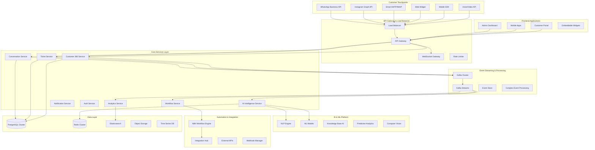

# Advanced Multi-Channel Ticket Management System - Design Document

## Overview

This design document outlines the architecture for an advanced ticket management system that leverages cutting-edge technologies to create a customer support platform superior to Freshdesk, WATI, and other market leaders. The system integrates multi-channel communication (WhatsApp, Instagram, Email, Web), AI-powered automation, N8N workflow orchestration, Kafka event streaming, and advanced CRM capabilities.

The architecture is built on a microservices foundation with event-driven communication, real-time processing, and intelligent automation to deliver exceptional customer experiences and operational efficiency.

## Architecture

### High-Level System Architecture



### Microservices Architecture

#### Core Service Components

1. **Conversation Orchestrator Service**
   - Multi-channel message ingestion and normalization
   - Conversation threading and context management
   - Real-time message routing and delivery
   - Channel-specific formatting and media handling

2. **Advanced Ticket Management Service**
   - Intelligent ticket lifecycle management
   - SLA monitoring and escalation
   - Bulk operations and automation
   - Advanced search and filtering

3. **Customer 360 CRM Service**
   - Unified customer profile management
   - Behavioral analytics and segmentation
   - Customer journey tracking
   - Relationship and value scoring

4. **AI Intelligence Service**
   - Natural language processing and understanding
   - Sentiment analysis and emotion detection
   - Intent classification and entity extraction
   - Predictive analytics and recommendations

5. **Workflow Automation Service**
   - N8N integration and orchestration
   - Business rule engine
   - Automated response generation
   - Dynamic routing and assignment

6. **Advanced Analytics Service**
   - Real-time metrics and KPI calculation
   - Predictive modeling and forecasting
   - Custom report generation
   - Performance optimization insights

## Components and Interfaces

### 1. Multi-Channel Conversation Management

#### Conversation Orchestrator Interface
```typescript
interface ConversationOrchestratorInterface {
  // Channel integration
  ingestMessage(channelMessage: ChannelMessage): Promise<ProcessedMessage>
  normalizeMessage(rawMessage: RawMessage, channel: Channel): Promise<NormalizedMessage>
  
  // Conversation threading
  createConversationThread(customerId: string, channelId: string): Promise<ConversationThread>
  mergeConversations(conversationIds: string[]): Promise<ConversationThread>
  
  // Context management
  getConversationContext(conversationId: string): Promise<ConversationContext>
  updateConversationContext(conversationId: string, context: Partial<ConversationContext>): Promise<void>
  
  // Real-time processing
  broadcastMessage(conversationId: string, message: ProcessedMessage): Promise<void>
  notifyAgents(conversationId: string, event: ConversationEvent): Promise<void>
}
```

#### Channel-Specific Adapters
```typescript
interface ChannelAdapter {
  // Message handling
  receiveMessage(webhook: WebhookPayload): Promise<ChannelMessage>
  sendMessage(conversationId: string, message: OutgoingMessage): Promise<MessageDeliveryResult>
  
  // Media handling
  downloadMedia(mediaId: string): Promise<MediaFile>
  uploadMedia(file: MediaFile): Promise<string>
  
  // Channel capabilities
  getSupportedFeatures(): ChannelFeatures
  validateMessage(message: OutgoingMessage): ValidationResult
}

// WhatsApp Business API Adapter
class WhatsAppAdapter implements ChannelAdapter {
  async receiveMessage(webhook: WhatsAppWebhook): Promise<WhatsAppMessage>
  async sendMessage(conversationId: string, message: WhatsAppOutgoingMessage): Promise<MessageDeliveryResult>
  async downloadMedia(mediaId: string): Promise<MediaFile>
  async sendTemplate(conversationId: string, template: WhatsAppTemplate): Promise<MessageDeliveryResult>
}

// Instagram Graph API Adapter
class InstagramAdapter implements ChannelAdapter {
  async receiveMessage(webhook: InstagramWebhook): Promise<InstagramMessage>
  async sendMessage(conversationId: string, message: InstagramOutgoingMessage): Promise<MessageDeliveryResult>
  async getStoryMentions(): Promise<StoryMention[]>
  async replyToStory(storyId: string, reply: string): Promise<MessageDeliveryResult>
}
```

### 2. Advanced AI Intelligence System

#### AI Intelligence Service Interface
```typescript
interface AIIntelligenceServiceInterface {
  // Natural Language Processing
  analyzeIntent(message: string, context: ConversationContext): Promise<IntentAnalysis>
  extractEntities(message: string): Promise<EntityExtraction>
  detectLanguage(message: string): Promise<LanguageDetection>
  translateMessage(message: string, targetLanguage: string): Promise<Translation>
  
  // Sentiment and Emotion Analysis
  analyzeSentiment(message: string): Promise<SentimentAnalysis>
  detectEmotions(message: string): Promise<EmotionAnalysis>
  assessUrgency(message: string, context: ConversationContext): Promise<UrgencyScore>
  
  // Response Generation
  generateResponseSuggestions(conversationId: string, context: ConversationContext): Promise<ResponseSuggestion[]>
  generateAutoResponse(conversationId: string, intent: Intent): Promise<AutoResponse>
  
  // Predictive Analytics
  predictResolutionTime(ticketData: TicketData): Promise<ResolutionTimePrediction>
  predictCustomerSatisfaction(conversationId: string): Promise<SatisfactionPrediction>
  identifyChurnRisk(customerId: string): Promise<ChurnRiskAssessment>
  
  // Knowledge Management
  findRelevantKnowledge(query: string, context: ConversationContext): Promise<KnowledgeResult[]>
  suggestKnowledgeCreation(ticketResolution: TicketResolution): Promise<KnowledgeSuggestion>
}
```

#### Machine Learning Models
```typescript
interface MLModelInterface {
  // Model management
  loadModel(modelId: string): Promise<void>
  updateModel(modelId: string, trainingData: TrainingData): Promise<ModelUpdateResult>
  
  // Prediction
  predict(input: ModelInput): Promise<ModelOutput>
  batchPredict(inputs: ModelInput[]): Promise<ModelOutput[]>
  
  // Performance monitoring
  getModelMetrics(): Promise<ModelMetrics>
  validateModel(testData: TestData): Promise<ValidationResult>
}

// Specific ML Models
class IntentClassificationModel implements MLModelInterface {
  async predict(message: string): Promise<IntentPrediction>
}

class SentimentAnalysisModel implements MLModelInterface {
  async predict(message: string): Promise<SentimentPrediction>
}

class ChurnPredictionModel implements MLModelInterface {
  async predict(customerData: CustomerData): Promise<ChurnPrediction>
}
```

### 3. Event-Driven Architecture with Kafka

#### Event Streaming Interface
```typescript
interface EventStreamingInterface {
  // Event publishing
  publishEvent(topic: string, event: DomainEvent): Promise<void>
  publishBatch(topic: string, events: DomainEvent[]): Promise<void>
  
  // Event consumption
  subscribeToTopic(topic: string, handler: EventHandler): Promise<Subscription>
  createConsumerGroup(groupId: string, topics: string[]): Promise<ConsumerGroup>
  
  // Stream processing
  createStream(inputTopic: string, outputTopic: string, processor: StreamProcessor): Promise<Stream>
  aggregateEvents(topic: string, aggregator: EventAggregator): Promise<AggregatedStream>
}

// Domain Events
interface DomainEvent {
  eventId: string
  eventType: string
  aggregateId: string
  aggregateType: string
  eventData: Record<string, any>
  metadata: EventMetadata
  timestamp: Date
}

// Event Types
class MessageReceivedEvent implements DomainEvent {
  eventType = 'message.received'
  aggregateType = 'conversation'
  eventData: {
    conversationId: string
    messageId: string
    senderId: string
    content: string
    channel: string
    timestamp: Date
  }
}

class TicketStatusChangedEvent implements DomainEvent {
  eventType = 'ticket.status.changed'
  aggregateType = 'ticket'
  eventData: {
    ticketId: string
    oldStatus: string
    newStatus: string
    changedBy: string
    reason?: string
  }
}
```

#### Stream Processing
```typescript
interface StreamProcessor {
  process(event: DomainEvent): Promise<DomainEvent[]>
}

// Real-time Analytics Stream Processor
class AnalyticsStreamProcessor implements StreamProcessor {
  async process(event: DomainEvent): Promise<DomainEvent[]> {
    switch (event.eventType) {
      case 'message.received':
        return this.processMessageMetrics(event)
      case 'ticket.resolved':
        return this.processResolutionMetrics(event)
      default:
        return []
    }
  }
  
  private async processMessageMetrics(event: MessageReceivedEvent): Promise<DomainEvent[]> {
    // Update real-time metrics
    // Generate analytics events
  }
}

// AI Processing Stream Processor
class AIStreamProcessor implements StreamProcessor {
  async process(event: DomainEvent): Promise<DomainEvent[]> {
    if (event.eventType === 'message.received') {
      const analysis = await this.aiService.analyzeMessage(event.eventData.content)
      return [
        new MessageAnalyzedEvent({
          messageId: event.eventData.messageId,
          analysis: analysis
        })
      ]
    }
    return []
  }
}
```

### 4. Advanced Workflow Automation with N8N

#### Workflow Service Interface
```typescript
interface WorkflowServiceInterface {
  // Workflow management
  createWorkflow(definition: WorkflowDefinition): Promise<Workflow>
  updateWorkflow(workflowId: string, definition: WorkflowDefinition): Promise<Workflow>
  executeWorkflow(workflowId: string, input: WorkflowInput): Promise<WorkflowExecution>
  
  // Trigger management
  registerTrigger(trigger: WorkflowTrigger): Promise<void>
  unregisterTrigger(triggerId: string): Promise<void>
  
  // Integration management
  createIntegration(integration: IntegrationDefinition): Promise<Integration>
  testIntegration(integrationId: string): Promise<IntegrationTestResult>
}

// N8N Integration
class N8NWorkflowService implements WorkflowServiceInterface {
  private n8nClient: N8NClient
  
  async createWorkflow(definition: WorkflowDefinition): Promise<Workflow> {
    const n8nWorkflow = this.convertToN8NFormat(definition)
    const result = await this.n8nClient.createWorkflow(n8nWorkflow)
    return this.convertFromN8NFormat(result)
  }
  
  async executeWorkflow(workflowId: string, input: WorkflowInput): Promise<WorkflowExecution> {
    return await this.n8nClient.executeWorkflow(workflowId, input)
  }
}
```

#### Workflow Definitions
```typescript
interface WorkflowDefinition {
  id: string
  name: string
  description: string
  triggers: WorkflowTrigger[]
  nodes: WorkflowNode[]
  connections: WorkflowConnection[]
  settings: WorkflowSettings
}

interface WorkflowTrigger {
  type: 'event' | 'schedule' | 'webhook' | 'manual'
  configuration: Record<string, any>
  conditions?: WorkflowCondition[]
}

// Example: Auto-routing workflow
const autoRoutingWorkflow: WorkflowDefinition = {
  id: 'auto-routing-v1',
  name: 'Intelligent Ticket Routing',
  description: 'Automatically route tickets based on content, customer, and agent availability',
  triggers: [
    {
      type: 'event',
      configuration: {
        eventType: 'ticket.created'
      }
    }
  ],
  nodes: [
    {
      type: 'ai-analysis',
      name: 'Analyze Ticket Content',
      configuration: {
        analysisTypes: ['intent', 'sentiment', 'urgency', 'category']
      }
    },
    {
      type: 'customer-lookup',
      name: 'Get Customer Profile',
      configuration: {
        includeHistory: true,
        includePurchases: true
      }
    },
    {
      type: 'agent-matching',
      name: 'Find Best Agent',
      configuration: {
        criteria: ['skills', 'workload', 'availability', 'customer_history']
      }
    },
    {
      type: 'ticket-assignment',
      name: 'Assign Ticket',
      configuration: {
        notifyAgent: true,
        setSLA: true
      }
    }
  ]
}
```

### 5. Customer 360 CRM System

#### Customer 360 Service Interface
```typescript
interface Customer360ServiceInterface {
  // Profile management
  getCustomerProfile(customerId: string): Promise<CustomerProfile>
  updateCustomerProfile(customerId: string, updates: Partial<CustomerProfile>): Promise<CustomerProfile>
  mergeCustomerProfiles(primaryId: string, secondaryIds: string[]): Promise<CustomerProfile>
  
  // Journey tracking
  getCustomerJourney(customerId: string, dateRange?: DateRange): Promise<CustomerJourney>
  addJourneyEvent(customerId: string, event: JourneyEvent): Promise<void>
  
  // Behavioral analysis
  getCustomerBehaviorAnalysis(customerId: string): Promise<BehaviorAnalysis>
  getCustomerSegmentation(customerId: string): Promise<CustomerSegment[]>
  
  // Value calculation
  calculateCustomerLifetimeValue(customerId: string): Promise<LifetimeValue>
  getCustomerHealthScore(customerId: string): Promise<HealthScore>
  
  // Relationship management
  getCustomerRelationships(customerId: string): Promise<CustomerRelationship[]>
  identifyUpsellOpportunities(customerId: string): Promise<UpsellOpportunity[]>
}
```

#### Customer Data Models
```typescript
interface CustomerProfile {
  id: string
  personalInfo: PersonalInfo
  contactInfo: ContactInfo
  preferences: CustomerPreferences
  demographics: Demographics
  psychographics: Psychographics
  
  // Interaction history
  conversationHistory: ConversationSummary[]
  ticketHistory: TicketSummary[]
  purchaseHistory: Purchase[]
  
  // Analytics
  behaviorProfile: BehaviorProfile
  satisfactionHistory: SatisfactionScore[]
  engagementMetrics: EngagementMetrics
  
  // Business metrics
  lifetimeValue: number
  healthScore: number
  churnRisk: number
  segmentMembership: string[]
  
  // Timestamps
  createdAt: Date
  updatedAt: Date
  lastInteractionAt: Date
}

interface BehaviorProfile {
  communicationPatterns: {
    preferredChannels: ChannelPreference[]
    responseTimeExpectation: number
    activeHours: TimeRange[]
    communicationStyle: 'formal' | 'casual' | 'technical'
  }
  
  supportPatterns: {
    issueTypes: string[]
    resolutionPreference: 'self-service' | 'assisted' | 'escalation'
    satisfactionTrend: 'improving' | 'stable' | 'declining'
  }
  
  purchasePatterns: {
    buyingCycle: number
    pricesensitivity: 'low' | 'medium' | 'high'
    productCategories: string[]
    seasonality: SeasonalPattern[]
  }
}
```

## Data Models

### Enhanced Database Schema

```prisma
// Enhanced Conversation Model
model Conversation {
  id              String   @id @default(cuid())
  tenantId        String
  customerId      String
  channelId       String
  threadId        String?  // For conversation threading
  status          String   @default("active")
  priority        String   @default("normal")
  
  // AI Analysis
  aiAnalysis      ConversationAIAnalysis?
  
  // Context and metadata
  context         Json     @default("{}")
  metadata        Json     @default("{}")
  tags            String[] @default([])
  
  // Relationships
  customer        Customer @relation(fields: [customerId], references: [id])
  channel         Channel  @relation(fields: [channelId], references: [id])
  messages        Message[]
  tickets         Ticket[]
  
  // Timestamps
  createdAt       DateTime @default(now())
  updatedAt       DateTime @updatedAt
  lastMessageAt   DateTime?
  
  @@map("conversations")
}

// AI Analysis for Conversations
model ConversationAIAnalysis {
  id                    String   @id @default(cuid())
  conversationId        String   @unique
  
  // Intent and classification
  primaryIntent         String?
  intentConfidence      Float?
  category              String?
  subcategory           String?
  
  // Sentiment analysis
  overallSentiment      String?
  sentimentScore        Float?
  emotionalState        Json?    // anger, frustration, satisfaction, etc.
  
  // Urgency and priority
  urgencyScore          Float?
  priorityRecommendation String?
  escalationRisk        Float?
  
  // Language and communication
  detectedLanguage      String?
  communicationStyle    String?
  complexityScore       Float?
  
  // Predictions
  resolutionTimePrediction Int?   // in minutes
  satisfactionPrediction   Float?
  churnRiskScore          Float?
  
  // Knowledge and suggestions
  suggestedResponses    Json     @default("[]")
  relevantKnowledge     Json     @default("[]")
  recommendedActions    Json     @default("[]")
  
  // Analysis metadata
  analysisVersion       String   @default("1.0")
  lastAnalyzedAt        DateTime @default(now())
  
  conversation          Conversation @relation(fields: [conversationId], references: [id], onDelete: Cascade)
  
  @@map("conversation_ai_analysis")
}

// Enhanced Customer Model
model Customer {
  id                String   @id @default(cuid())
  tenantId          String
  
  // Basic information
  email             String?
  phone             String?
  firstName         String?
  lastName          String?
  company           String?
  
  // Extended profile
  profile           CustomerProfile?
  
  // Preferences and settings
  preferences       Json     @default("{}")
  communicationPrefs Json    @default("{}")
  
  // Analytics and scoring
  lifetimeValue     Float?
  healthScore       Float?
  churnRisk         Float?
  satisfactionScore Float?
  
  // Segmentation
  segments          String[] @default([])
  tags              String[] @default([])
  
  // Custom fields
  customFields      Json     @default("{}")
  
  // Relationships
  conversations     Conversation[]
  tickets           Ticket[]
  journeyEvents     CustomerJourneyEvent[]
  
  // Timestamps
  createdAt         DateTime @default(now())
  updatedAt         DateTime @updatedAt
  lastInteractionAt DateTime?
  
  @@unique([tenantId, email])
  @@map("customers")
}

// Customer Profile Extension
model CustomerProfile {
  id                String   @id @default(cuid())
  customerId        String   @unique
  
  // Demographics
  age               Int?
  gender            String?
  location          Json?    // country, city, timezone
  occupation        String?
  industry          String?
  
  // Psychographics
  personality       Json?    // personality traits
  interests         String[] @default([])
  values            String[] @default([])
  
  // Behavioral data
  behaviorProfile   Json     @default("{}")
  interactionHistory Json    @default("{}")
  
  // Business metrics
  totalPurchases    Float    @default(0)
  averageOrderValue Float    @default(0)
  purchaseFrequency Float    @default(0)
  
  // Support metrics
  totalTickets      Int      @default(0)
  averageResolutionTime Int  @default(0)
  escalationRate    Float    @default(0)
  
  customer          Customer @relation(fields: [customerId], references: [id], onDelete: Cascade)
  
  @@map("customer_profiles")
}

// Customer Journey Events
model CustomerJourneyEvent {
  id          String   @id @default(cuid())
  customerId  String
  
  eventType   String   // interaction, purchase, support, etc.
  eventName   String
  eventData   Json     @default("{}")
  
  channel     String?
  touchpoint  String?
  
  // Context
  sessionId   String?
  campaignId  String?
  source      String?
  
  // Metrics
  value       Float?
  duration    Int?     // in seconds
  
  customer    Customer @relation(fields: [customerId], references: [id], onDelete: Cascade)
  
  createdAt   DateTime @default(now())
  
  @@map("customer_journey_events")
}

// Advanced Workflow Executions
model WorkflowExecution {
  id              String   @id @default(cuid())
  tenantId        String
  workflowId      String
  
  // Trigger information
  triggeredBy     String   // user_id or 'system'
  triggerType     String   // event, schedule, manual, webhook
  triggerData     Json     @default("{}")
  
  // Execution details
  status          String   @default("running") // running, completed, failed, cancelled
  input           Json     @default("{}")
  output          Json?
  
  // Performance metrics
  startedAt       DateTime @default(now())
  completedAt     DateTime?
  duration        Int?     // in milliseconds
  
  // Error handling
  errorMessage    String?
  errorDetails    Json?
  retryCount      Int      @default(0)
  
  // Context
  contextData     Json     @default("{}")
  metadata        Json     @default("{}")
  
  // Relationships
  workflow        WorkflowRule @relation(fields: [workflowId], references: [id])
  tenant          Tenant       @relation(fields: [tenantId], references: [id], onDelete: Cascade)
  
  @@map("workflow_executions")
}

// Event Store for Event Sourcing
model EventStore {
  id              String   @id @default(cuid())
  
  // Event identification
  eventId         String   @unique
  eventType       String
  eventVersion    String   @default("1.0")
  
  // Aggregate information
  aggregateId     String
  aggregateType   String
  aggregateVersion Int
  
  // Event data
  eventData       Json
  metadata        Json     @default("{}")
  
  // Causation and correlation
  causationId     String?  // ID of the command that caused this event
  correlationId   String?  // ID to group related events
  
  // Timestamps
  timestamp       DateTime @default(now())
  
  @@index([aggregateId, aggregateType])
  @@index([eventType])
  @@index([timestamp])
  @@map("event_store")
}
```

## Testing Strategy

### Comprehensive Testing Approach

#### 1. Unit Testing
```typescript
// Service layer testing with comprehensive mocking
describe('ConversationOrchestratorService', () => {
  let service: ConversationOrchestratorService
  let mockAIService: jest.Mocked<AIIntelligenceService>
  let mockEventBus: jest.Mocked<EventBus>
  
  beforeEach(() => {
    // Setup mocks and service instance
  })
  
  describe('ingestMessage', () => {
    it('should process WhatsApp message correctly', async () => {
      // Test WhatsApp message processing
    })
    
    it('should handle Instagram media messages', async () => {
      // Test Instagram media handling
    })
    
    it('should merge conversations from same customer', async () => {
      // Test conversation threading
    })
  })
})
```

#### 2. Integration Testing
```typescript
// Database and external service integration
describe('Customer360Service Integration', () => {
  let service: Customer360Service
  let testDb: TestDatabase
  
  beforeAll(async () => {
    testDb = await setupTestDatabase()
  })
  
  it('should calculate customer lifetime value correctly', async () => {
    // Test CLV calculation with real data
  })
  
  it('should integrate with external CRM systems', async () => {
    // Test CRM synchronization
  })
})
```

#### 3. Event-Driven Testing
```typescript
// Kafka event processing testing
describe('Event Processing', () => {
  let eventBus: TestEventBus
  let streamProcessor: AIStreamProcessor
  
  it('should process message events in correct order', async () => {
    // Test event ordering and processing
  })
  
  it('should handle event replay correctly', async () => {
    // Test event sourcing replay
  })
})
```

#### 4. AI/ML Testing
```typescript
// AI model testing with test datasets
describe('AI Intelligence Service', () => {
  let aiService: AIIntelligenceService
  let testDataset: TestDataset
  
  it('should classify intents with high accuracy', async () => {
    // Test intent classification accuracy
  })
  
  it('should detect sentiment correctly', async () => {
    // Test sentiment analysis
  })
})
```

#### 5. Performance Testing
```typescript
// Load testing for high-volume scenarios
describe('Performance Tests', () => {
  it('should handle 10,000 concurrent conversations', async () => {
    // Load testing
  })
  
  it('should process 1M events per hour', async () => {
    // Event processing performance
  })
})
```

## Security and Compliance

### Enterprise Security Framework

#### 1. Data Protection
- **Encryption**: AES-256 encryption for data at rest, TLS 1.3 for data in transit
- **Key Management**: AWS KMS or HashiCorp Vault for key rotation and management
- **Data Masking**: PII masking in logs and non-production environments
- **Tokenization**: Sensitive data tokenization for secure processing

#### 2. Access Control
- **Zero Trust Architecture**: Never trust, always verify principle
- **Multi-Factor Authentication**: Required for all admin access
- **Role-Based Access Control**: Granular permissions based on job functions
- **API Security**: OAuth 2.0, JWT tokens, rate limiting, and API keys

#### 3. Compliance Framework
- **GDPR Compliance**: Data subject rights, consent management, data portability
- **CCPA Compliance**: California privacy rights and data handling
- **SOC 2 Type II**: Security, availability, and confidentiality controls
- **ISO 27001**: Information security management system

#### 4. Monitoring and Auditing
- **Security Information and Event Management (SIEM)**: Real-time security monitoring
- **Audit Logging**: Comprehensive audit trails for all system activities
- **Threat Detection**: AI-powered anomaly detection and threat intelligence
- **Incident Response**: Automated incident response workflows

## Performance and Scalability

### Scalability Architecture

#### 1. Horizontal Scaling
- **Microservices**: Independent scaling of service components
- **Container Orchestration**: Kubernetes for automated scaling and deployment
- **Load Balancing**: Intelligent load distribution across service instances
- **Database Sharding**: Tenant-based data partitioning for scale

#### 2. Performance Optimization
- **Caching Strategy**: Multi-layer caching with Redis and CDN
- **Database Optimization**: Query optimization, indexing, and connection pooling
- **Asynchronous Processing**: Event-driven architecture for non-blocking operations
- **Content Delivery**: Global CDN for static assets and media files

#### 3. Monitoring and Observability
- **Application Performance Monitoring**: Real-time performance metrics
- **Distributed Tracing**: Request tracing across microservices
- **Log Aggregation**: Centralized logging with ELK stack
- **Custom Metrics**: Business-specific KPIs and performance indicators

This design provides a comprehensive foundation for building an advanced ticket management system that leverages cutting-edge technologies to deliver superior customer support experiences while maintaining enterprise-grade security, scalability, and performance.