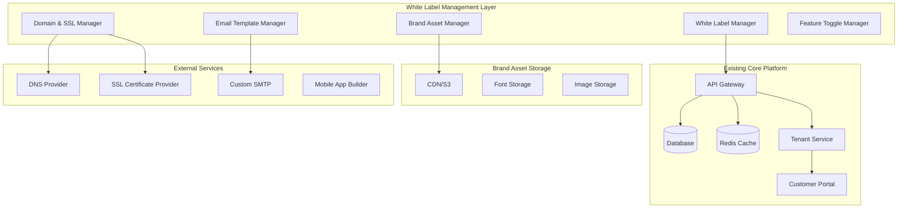
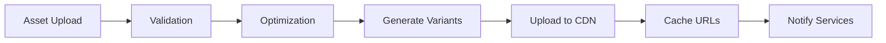
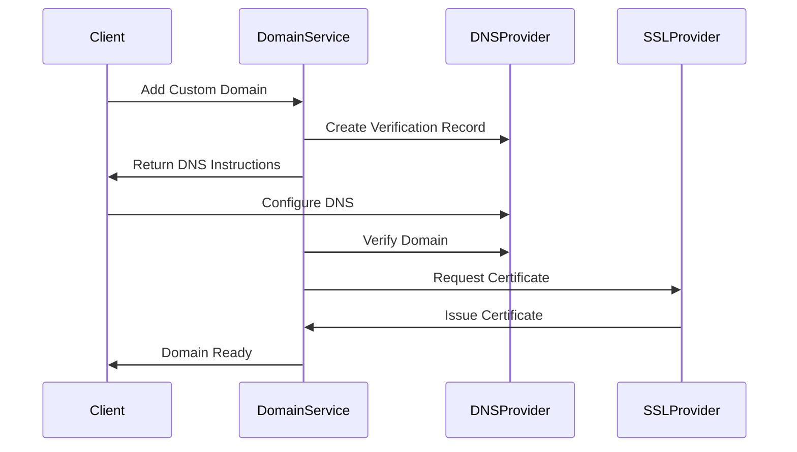
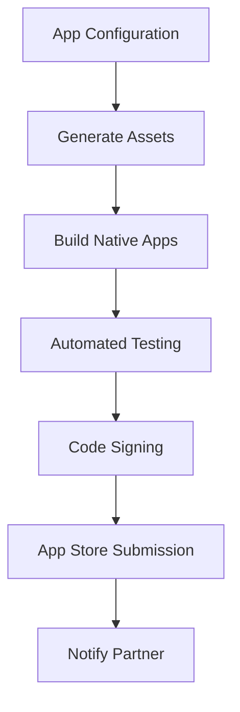

# Advanced White Labeling System Design

## Overview

The Advanced White Labeling System transforms our omnichannel support platform into a comprehensive white label solution. Building on our existing multi-tenant architecture, this system enables partners to completely rebrand and customize the platform as their own product, from basic theming to complete mobile app publishing.

The design leverages our existing `Tenant`, `CustomerPortal`, `CustomDomain`, and branding infrastructure while introducing new models and services to support enterprise-grade white labeling capabilities.

## Architecture

### High-Level Architecture



### Component Architecture

The system consists of several key components that work together to provide comprehensive white labeling:

1. **White Label Configuration Service** - Central management of all white label settings
2. **Brand Asset Management Service** - Upload, optimization, and delivery of brand assets
3. **Domain Management Service** - Custom domain setup, SSL provisioning, and DNS management
4. **Template Engine Service** - Dynamic template rendering with brand customization
5. **Feature Toggle Service** - Granular feature control and access management
6. **Mobile App Generation Service** - Automated mobile app building and deployment
7. **Analytics Branding Service** - Branded reporting and dashboard generation

## Components and Interfaces

### 1. White Label Configuration Service

**Purpose:** Central hub for managing all white labeling configurations and settings.

**Key Interfaces:**
- `WhiteLabelConfigService.getConfig(tenantId: string): WhiteLabelConfig`
- `WhiteLabelConfigService.updateConfig(tenantId: string, config: Partial<WhiteLabelConfig>): Promise<void>`
- `WhiteLabelConfigService.validateConfig(config: WhiteLabelConfig): ValidationResult`
- `WhiteLabelConfigService.propagateChanges(tenantId: string, changes: ConfigChange[]): Promise<void>`

**Configuration Structure:**
```typescript
interface WhiteLabelConfig {
  tier: 'basic' | 'advanced' | 'enterprise';
  branding: {
    primaryColor: string;
    secondaryColor: string;
    accentColor: string;
    logoUrl: string;
    faviconUrl: string;
    fontFamily: string;
    customCss?: string;
  };
  domains: {
    primary: string;
    aliases: string[];
    sslConfig: SSLConfig;
  };
  features: {
    enabled: string[];
    disabled: string[];
    customModules: CustomModule[];
  };
  localization: {
    defaultLanguage: string;
    supportedLanguages: string[];
    rtlSupport: boolean;
  };
  compliance: {
    privacyPolicyUrl: string;
    termsOfServiceUrl: string;
    dataProcessingAgreement: string;
    certifications: string[];
  };
}
```

### 2. Brand Asset Management Service

**Purpose:** Handles upload, optimization, versioning, and delivery of brand assets.

**Key Interfaces:**
- `BrandAssetService.uploadAsset(tenantId: string, asset: AssetUpload): Promise<AssetMetadata>`
- `BrandAssetService.optimizeAsset(asset: AssetMetadata): Promise<OptimizedAsset[]>`
- `BrandAssetService.generateVariants(asset: AssetMetadata): Promise<AssetVariant[]>`
- `BrandAssetService.getAssetUrl(tenantId: string, assetType: string, variant?: string): string`

**Asset Processing Pipeline:**


### 3. Domain Management Service

**Purpose:** Manages custom domains, SSL certificates, and DNS configuration.

**Key Interfaces:**
- `DomainService.addDomain(tenantId: string, domain: string): Promise<DomainSetup>`
- `DomainService.verifyDomain(tenantId: string, domain: string): Promise<VerificationResult>`
- `DomainService.provisionSSL(domain: string): Promise<SSLCertificate>`
- `DomainService.renewSSL(domain: string): Promise<void>`

**Domain Setup Flow:**


### 4. Template Engine Service

**Purpose:** Renders templates with dynamic branding and customization.

**Key Interfaces:**
- `TemplateService.renderTemplate(templateId: string, context: TemplateContext): Promise<string>`
- `TemplateService.createCustomTemplate(tenantId: string, template: TemplateDefinition): Promise<void>`
- `TemplateService.previewTemplate(template: TemplateDefinition, context: TemplateContext): Promise<string>`

**Template Types:**
- Email templates (transactional, marketing, notifications)
- Portal pages (home, contact, knowledge base)
- API documentation pages
- Mobile app screens
- PDF reports and invoices

### 5. Feature Toggle Service

**Purpose:** Manages granular feature access and customization per tenant.

**Key Interfaces:**
- `FeatureToggleService.isFeatureEnabled(tenantId: string, feature: string): boolean`
- `FeatureToggleService.getEnabledFeatures(tenantId: string): string[]`
- `FeatureToggleService.updateFeatureAccess(tenantId: string, features: FeatureUpdate[]): Promise<void>`

**Feature Categories:**
- Core features (tickets, customers, conversations)
- Advanced features (AI analysis, automation, integrations)
- Premium features (advanced analytics, custom fields, API access)
- Enterprise features (SSO, advanced security, custom modules)

### 6. Mobile App Generation Service

**Purpose:** Generates and manages white-labeled mobile applications.

**Key Interfaces:**
- `MobileAppService.generateApp(tenantId: string, config: MobileAppConfig): Promise<AppBuild>`
- `MobileAppService.updateAppConfig(tenantId: string, config: Partial<MobileAppConfig>): Promise<void>`
- `MobileAppService.publishApp(tenantId: string, platform: 'ios' | 'android'): Promise<PublishResult>`

**App Generation Pipeline:**


## Data Models

### Extended Tenant Model

Building on the existing `Tenant` model, we add comprehensive white labeling fields:

```typescript
// Extension to existing Tenant model
interface TenantWhiteLabel {
  whiteLabelTier: 'basic' | 'advanced' | 'enterprise';
  brandAssets: BrandAsset[];
  customDomains: CustomDomain[];
  featureToggles: FeatureToggle[];
  emailSettings: EmailSettings;
  mobileAppConfig?: MobileAppConfig;
  complianceSettings: ComplianceSettings;
  localizationSettings: LocalizationSettings;
}
```

### New Data Models

**BrandAsset Model:**
```typescript
interface BrandAsset {
  id: string;
  tenantId: string;
  type: 'logo' | 'favicon' | 'email_header' | 'mobile_icon' | 'font';
  originalUrl: string;
  variants: AssetVariant[];
  metadata: AssetMetadata;
  version: number;
  isActive: boolean;
  createdAt: Date;
  updatedAt: Date;
}

interface AssetVariant {
  size: string; // e.g., '32x32', '512x512', 'original'
  format: string; // e.g., 'png', 'svg', 'webp'
  url: string;
  fileSize: number;
}
```

**WhiteLabelTemplate Model:**
```typescript
interface WhiteLabelTemplate {
  id: string;
  tenantId: string;
  type: 'email' | 'portal_page' | 'api_doc' | 'mobile_screen' | 'report';
  name: string;
  content: string; // HTML/template content
  variables: TemplateVariable[];
  isActive: boolean;
  version: number;
  createdAt: Date;
  updatedAt: Date;
}
```

**FeatureToggle Model:**
```typescript
interface FeatureToggle {
  id: string;
  tenantId: string;
  featureKey: string;
  isEnabled: boolean;
  configuration?: Record<string, any>;
  restrictions?: FeatureRestriction[];
  createdAt: Date;
  updatedAt: Date;
}
```

**MobileAppConfig Model:**
```typescript
interface MobileAppConfig {
  id: string;
  tenantId: string;
  appName: string;
  bundleId: string;
  version: string;
  buildNumber: number;
  icons: MobileAppIcon[];
  splashScreens: MobileAppSplashScreen[];
  colorScheme: MobileColorScheme;
  features: string[];
  pushNotificationConfig: PushNotificationConfig;
  deepLinkConfig: DeepLinkConfig;
  storeMetadata: AppStoreMetadata;
  buildStatus: 'pending' | 'building' | 'ready' | 'failed';
  lastBuildAt?: Date;
}
```

## Error Handling

### White Label Specific Errors

**Domain Configuration Errors:**
- `DOMAIN_VERIFICATION_FAILED` - Domain ownership verification failed
- `SSL_PROVISIONING_FAILED` - SSL certificate provisioning failed
- `DNS_CONFIGURATION_INVALID` - DNS records not properly configured

**Asset Management Errors:**
- `ASSET_FORMAT_UNSUPPORTED` - Uploaded asset format not supported
- `ASSET_SIZE_EXCEEDED` - Asset file size exceeds limits
- `ASSET_OPTIMIZATION_FAILED` - Asset optimization process failed

**Template Rendering Errors:**
- `TEMPLATE_COMPILATION_FAILED` - Template compilation failed
- `TEMPLATE_VARIABLE_MISSING` - Required template variable not provided
- `TEMPLATE_SYNTAX_ERROR` - Invalid template syntax

**Feature Toggle Errors:**
- `FEATURE_NOT_AVAILABLE` - Feature not available for current tier
- `FEATURE_DEPENDENCY_MISSING` - Required feature dependency not enabled
- `FEATURE_QUOTA_EXCEEDED` - Feature usage quota exceeded

### Error Recovery Strategies

1. **Graceful Degradation:** When custom branding fails, fall back to default branding
2. **Asset Fallbacks:** Maintain fallback assets for critical branding elements
3. **Domain Fallbacks:** Redirect to primary domain when custom domain fails
4. **Template Fallbacks:** Use default templates when custom templates fail
5. **Feature Fallbacks:** Disable dependent features when core features are unavailable

## Testing Strategy

### Unit Testing

**Brand Asset Service Tests:**
- Asset upload validation
- Image optimization algorithms
- Variant generation accuracy
- CDN integration

**Domain Service Tests:**
- DNS verification logic
- SSL certificate management
- Domain routing configuration
- Fallback mechanisms

**Template Service Tests:**
- Template compilation
- Variable substitution
- Multi-language rendering
- Performance optimization

### Integration Testing

**End-to-End White Label Setup:**
1. Create new tenant with enterprise tier
2. Upload brand assets and verify optimization
3. Configure custom domain and verify SSL
4. Customize email templates and test delivery
5. Configure mobile app and verify build
6. Test complete customer journey with branding

**Cross-Service Integration:**
- Brand asset propagation across services
- Domain configuration impact on all touchpoints
- Feature toggle effects on UI and API
- Template rendering with dynamic branding

### Performance Testing

**Asset Delivery Performance:**
- CDN response times for brand assets
- Image optimization impact on load times
- Cache hit rates for branded content

**Template Rendering Performance:**
- Template compilation time
- Dynamic content generation speed
- Memory usage during bulk operations

**Domain Resolution Performance:**
- Custom domain response times
- SSL handshake performance
- DNS resolution speed

### Security Testing

**Asset Security:**
- File upload validation and sanitization
- Asset access control and permissions
- CDN security configuration

**Domain Security:**
- SSL certificate validation
- Domain hijacking prevention
- DNS security configuration

**Template Security:**
- Template injection prevention
- XSS protection in custom templates
- Content Security Policy compliance

## Deployment and Scaling Considerations

### Infrastructure Requirements

**Additional Services:**
- Brand asset CDN with global distribution
- DNS management service integration
- SSL certificate automation service
- Mobile app build infrastructure
- Template compilation service

**Database Scaling:**
- Separate read replicas for brand asset metadata
- Caching layer for frequently accessed configurations
- Partitioning strategy for multi-tenant data

**Storage Requirements:**
- High-availability storage for brand assets
- Versioned storage for asset history
- Backup and disaster recovery for critical branding data

### Monitoring and Observability

**Key Metrics:**
- Brand asset delivery performance
- Custom domain uptime and response times
- Template rendering success rates
- Mobile app build success rates
- Feature toggle usage patterns

**Alerting:**
- SSL certificate expiration warnings
- Domain verification failures
- Asset optimization failures
- Template compilation errors
- Mobile app build failures

**Logging:**
- Brand configuration changes
- Asset upload and optimization events
- Domain setup and verification steps
- Template rendering performance
- Feature toggle modifications

This design provides a comprehensive foundation for implementing an enterprise-grade white labeling system that transforms your platform into a fully customizable solution for partners and resellers.