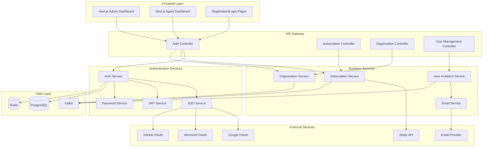
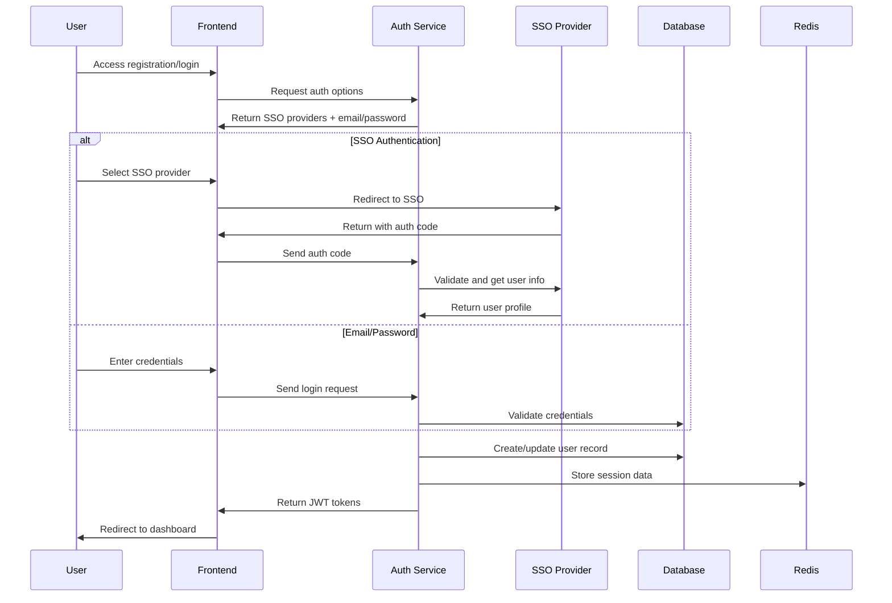

# Authentication System Design Document

## Overview

The authentication system for Glavito will provide a comprehensive SSO solution with subscription management, organization setup, and user invitation capabilities. The system will extend the existing NestJS authentication infrastructure to support multiple authentication providers, Stripe integration for subscriptions, and a seamless onboarding flow for admins and agents.

The design leverages the existing multi-tenant architecture with Prisma ORM, PostgreSQL database, Redis for session management, and Kafka for event-driven communication between services.

## Architecture

### High-Level Architecture



### Authentication Flow



## Components and Interfaces

### 1. Authentication Module

#### Enhanced Auth Service
Extends the existing `AuthService` to support:
- Multiple SSO providers (Google, Microsoft, GitHub)
- Registration flow with email verification
- Password reset functionality
- Session management with Redis
- Rate limiting and security measures

```typescript
interface AuthService {
  // Existing methods
  login(loginDto: LoginRequest): Promise<LoginResponse>
  refreshToken(refreshToken: string): Promise<TokenResponse>
  logout(refreshToken: string): Promise<void>
  
  // New methods for enhanced authentication
  register(registerDto: RegisterRequest): Promise<RegisterResponse>
  initiateSSO(provider: SSOProvider, redirectUrl: string): Promise<SSOInitiateResponse>
  handleSSOCallback(provider: SSOProvider, code: string, state: string): Promise<LoginResponse>
  sendPasswordReset(email: string): Promise<void>
  resetPassword(token: string, newPassword: string): Promise<void>
  verifyEmail(token: string): Promise<void>
  resendVerification(email: string): Promise<void>
}
```

#### SSO Service
New service to handle multiple OAuth providers:

```typescript
interface SSOService {
  getAuthUrl(provider: SSOProvider, redirectUrl: string, state: string): string
  validateCallback(provider: SSOProvider, code: string): Promise<SSOUserProfile>
  refreshProviderToken(provider: SSOProvider, refreshToken: string): Promise<SSOTokens>
}
```

### 2. Subscription Management Module

#### Subscription Service
Handles Stripe integration and subscription lifecycle:

```typescript
interface SubscriptionService {
  createSubscription(tenantId: string, planId: string, paymentMethodId: string): Promise<Subscription>
  updateSubscription(subscriptionId: string, planId: string): Promise<Subscription>
  cancelSubscription(subscriptionId: string, cancelAtPeriodEnd: boolean): Promise<Subscription>
  handleWebhook(event: StripeEvent): Promise<void>
  getSubscriptionStatus(tenantId: string): Promise<SubscriptionStatus>
  createCustomerPortalSession(tenantId: string): Promise<PortalSession>
}
```

### 3. Organization Management Module

#### Organization Service
Manages tenant creation and configuration:

```typescript
interface OrganizationService {
  createOrganization(adminUserId: string, orgData: CreateOrganizationRequest): Promise<Organization>
  updateOrganization(tenantId: string, updates: UpdateOrganizationRequest): Promise<Organization>
  setupOrganizationDefaults(tenantId: string): Promise<void>
  validateSubdomain(subdomain: string): Promise<boolean>
}
```

### 4. User Invitation Module

#### Invitation Service
Handles agent invitations and onboarding:

```typescript
interface InvitationService {
  sendInvitation(tenantId: string, inviterUserId: string, invitation: InvitationRequest): Promise<Invitation>
  validateInvitation(token: string): Promise<InvitationDetails>
  acceptInvitation(token: string, userData: AcceptInvitationRequest): Promise<LoginResponse>
  resendInvitation(invitationId: string): Promise<void>
  revokeInvitation(invitationId: string): Promise<void>
}
```

## Data Models

### Enhanced User Model
Extends existing User model with SSO support:

```typescript
interface User {
  // Existing fields
  id: string
  tenantId: string
  email: string
  passwordHash?: string // Optional for SSO users
  firstName: string
  lastName: string
  role: 'admin' | 'agent' | 'customer'
  status: 'active' | 'inactive' | 'pending' | 'invited'
  avatar?: string
  lastLoginAt?: Date
  createdAt: Date
  updatedAt: Date
  
  // New fields for enhanced auth
  emailVerified: boolean
  emailVerificationToken?: string
  passwordResetToken?: string
  passwordResetExpires?: Date
  ssoProviders: SSOProvider[]
  twoFactorEnabled: boolean
  twoFactorSecret?: string
  loginAttempts: number
  lockoutUntil?: Date
}
```

### SSO Provider Model
New model for managing SSO connections:

```typescript
interface SSOProvider {
  id: string
  userId: string
  provider: 'google' | 'microsoft' | 'github'
  providerId: string
  email: string
  accessToken: string
  refreshToken?: string
  tokenExpires?: Date
  createdAt: Date
  updatedAt: Date
}
```

### Invitation Model
New model for managing user invitations:

```typescript
interface Invitation {
  id: string
  tenantId: string
  inviterUserId: string
  email: string
  role: 'agent' | 'admin'
  token: string
  status: 'pending' | 'accepted' | 'expired' | 'revoked'
  expiresAt: Date
  acceptedAt?: Date
  createdAt: Date
  updatedAt: Date
}
```

### Enhanced Subscription Model
Extends existing subscription model:

```typescript
interface Subscription {
  // Existing fields
  id: string
  tenantId: string
  plan: string
  status: string
  currentPeriodStart: Date
  currentPeriodEnd: Date
  cancelAtPeriodEnd: boolean
  stripeCustomerId?: string
  stripeSubscriptionId?: string
  createdAt: Date
  updatedAt: Date
  
  // New fields
  trialEndsAt?: Date
  canceledAt?: Date
  cancelReason?: string
  metadata: Record<string, any>
}
```

## Error Handling

### Authentication Errors
- `INVALID_CREDENTIALS`: Wrong email/password combination
- `ACCOUNT_LOCKED`: Too many failed login attempts
- `EMAIL_NOT_VERIFIED`: User must verify email before login
- `SSO_PROVIDER_ERROR`: Error communicating with SSO provider
- `TOKEN_EXPIRED`: JWT or refresh token has expired
- `INVALID_TOKEN`: Malformed or invalid token

### Subscription Errors
- `PAYMENT_FAILED`: Stripe payment processing failed
- `SUBSCRIPTION_EXPIRED`: Subscription has expired
- `PLAN_NOT_FOUND`: Requested subscription plan doesn't exist
- `BILLING_ADDRESS_REQUIRED`: Billing information incomplete

### Organization Errors
- `SUBDOMAIN_TAKEN`: Requested subdomain already in use
- `INVALID_SUBDOMAIN`: Subdomain format is invalid
- `ORGANIZATION_LIMIT_REACHED`: User has reached organization limit

### Invitation Errors
- `INVITATION_EXPIRED`: Invitation token has expired
- `INVITATION_ALREADY_ACCEPTED`: Invitation has already been used
- `INVALID_INVITATION`: Invitation token is invalid or revoked

## Testing Strategy

### Unit Tests
- **Auth Service Tests**: Test all authentication methods, token generation, and validation
- **SSO Service Tests**: Mock OAuth providers and test callback handling
- **Subscription Service Tests**: Mock Stripe API and test subscription lifecycle
- **Organization Service Tests**: Test tenant creation and validation logic
- **Invitation Service Tests**: Test invitation flow and token management

### Integration Tests
- **Authentication Flow**: End-to-end registration and login flows
- **SSO Integration**: Test with actual OAuth providers in staging
- **Stripe Integration**: Test subscription creation and webhook handling
- **Email Integration**: Test invitation and verification emails
- **Database Transactions**: Test multi-step operations with rollback scenarios

### Security Tests
- **Rate Limiting**: Test login attempt limits and account lockout
- **Token Security**: Test JWT token validation and expiration
- **Password Security**: Test password hashing and reset flows
- **CSRF Protection**: Test cross-site request forgery prevention
- **SQL Injection**: Test database query security

### Performance Tests
- **Authentication Load**: Test concurrent login requests
- **Database Performance**: Test query performance with large user datasets
- **Redis Performance**: Test session storage and retrieval performance
- **API Response Times**: Test all endpoints under load

### Frontend Testing
- **Component Tests**: Test React components with Jest and React Testing Library
- **E2E Tests**: Test complete user flows with Playwright or Cypress
- **Accessibility Tests**: Ensure WCAG compliance for all auth forms
- **Mobile Responsiveness**: Test on various device sizes and orientations

## Security Considerations

### Authentication Security
- **Password Hashing**: Use bcrypt with appropriate salt rounds
- **JWT Security**: Short-lived access tokens with secure refresh mechanism
- **Rate Limiting**: Implement progressive delays for failed login attempts
- **Account Lockout**: Temporary lockout after multiple failed attempts
- **Session Management**: Secure session storage in Redis with TTL

### Data Protection
- **Encryption at Rest**: Sensitive data encrypted in database
- **Encryption in Transit**: All communications over HTTPS/TLS
- **PII Handling**: Proper handling of personally identifiable information
- **Data Retention**: Implement data retention policies for compliance

### OAuth Security
- **State Parameter**: Use cryptographically secure state parameter
- **PKCE**: Implement Proof Key for Code Exchange for mobile apps
- **Scope Limitation**: Request minimal necessary OAuth scopes
- **Token Storage**: Secure storage of OAuth tokens

### Infrastructure Security
- **Environment Variables**: Secure management of secrets and API keys
- **CORS Configuration**: Proper cross-origin resource sharing setup
- **CSP Headers**: Content Security Policy headers for XSS protection
- **Audit Logging**: Comprehensive logging of security events