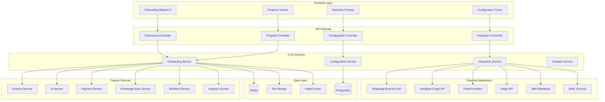
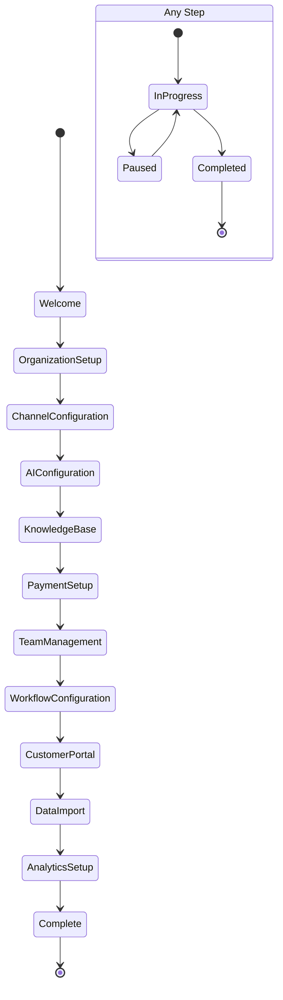

# Onboarding System Design Document

## Overview

The onboarding system for Glavito is a comprehensive post-authentication experience that transforms new users into fully operational ticketing platform administrators and agents. The system builds upon the existing authentication infrastructure and guides users through configuring AI-powered features, multi-channel communication, payment processing, team management, and all advanced platform capabilities.

The design leverages the existing multi-tenant architecture with progressive disclosure, real-time previews, and intelligent defaults to create an intuitive setup experience that can handle the complexity of a full-featured ticketing and CRM platform.

## Architecture

### High-Level Architecture



### Onboarding Flow Architecture



## Components and Interfaces

### 1. Onboarding Orchestration Module

#### Onboarding Service
Central service that manages the entire onboarding flow:

```typescript
interface OnboardingService {
  startOnboarding(userId: string, tenantId: string): Promise<OnboardingSession>
  getOnboardingProgress(sessionId: string): Promise<OnboardingProgress>
  updateStepProgress(sessionId: string, stepId: string, data: any): Promise<StepResult>
  pauseOnboarding(sessionId: string): Promise<void>
  resumeOnboarding(sessionId: string): Promise<OnboardingSession>
  completeOnboarding(sessionId: string): Promise<CompletionResult>
  getStepConfiguration(stepId: string): Promise<StepConfiguration>
}

interface OnboardingSession {
  id: string
  userId: string
  tenantId: string
  currentStep: string
  completedSteps: string[]
  stepData: Record<string, any>
  status: 'active' | 'paused' | 'completed'
  startedAt: Date
  lastActivityAt: Date
  estimatedCompletion: Date
}

interface OnboardingProgress {
  totalSteps: number
  completedSteps: number
  currentStep: string
  progressPercentage: number
  estimatedTimeRemaining: number
  nextRecommendedAction: string
}
```

### 2. Configuration Management Module

#### Configuration Service
Handles all platform configuration during onboarding:

```typescript
interface ConfigurationService {
  // Organization Configuration
  updateOrganizationBranding(tenantId: string, branding: BrandingConfig): Promise<void>
  uploadLogo(tenantId: string, logoFile: File): Promise<string>
  setColorScheme(tenantId: string, colors: ColorScheme): Promise<void>
  
  // Channel Configuration
  configureWhatsApp(tenantId: string, config: WhatsAppConfig): Promise<ChannelStatus>
  configureInstagram(tenantId: string, config: InstagramConfig): Promise<ChannelStatus>
  configureEmail(tenantId: string, config: EmailConfig): Promise<ChannelStatus>
  testChannelConnection(tenantId: string, channelType: string): Promise<ConnectionTest>
  
  // AI Configuration
  enableAIFeatures(tenantId: string, features: AIFeatureConfig): Promise<void>
  configureN8NWorkflows(tenantId: string, workflows: WorkflowTemplate[]): Promise<void>
  trainAIModel(tenantId: string, trainingData: TrainingData): Promise<ModelStatus>
  
  // Payment Configuration
  connectStripe(tenantId: string, stripeConfig: StripeConfig): Promise<PaymentStatus>
  setupBillingAutomation(tenantId: string, billingConfig: BillingConfig): Promise<void>
  
  // Workflow Configuration
  createTicketWorkflows(tenantId: string, workflows: WorkflowConfig[]): Promise<void>
  configureSLARules(tenantId: string, slaRules: SLARule[]): Promise<void>
  setupEscalationPaths(tenantId: string, escalations: EscalationPath[]): Promise<void>
}
```

### 3. Integration Management Module

#### Integration Service
Manages external service integrations:

```typescript
interface IntegrationService {
  // WhatsApp Business API Integration
  validateWhatsAppCredentials(credentials: WhatsAppCredentials): Promise<ValidationResult>
  setupWhatsAppWebhooks(tenantId: string, webhookUrl: string): Promise<WebhookStatus>
  
  // Instagram Graph API Integration
  authenticateInstagram(tenantId: string, accessToken: string): Promise<InstagramAuth>
  syncInstagramMessages(tenantId: string): Promise<SyncResult>
  
  // Email Provider Integration
  testEmailConnection(config: EmailConfig): Promise<ConnectionTest>
  setupEmailWebhooks(tenantId: string, config: EmailConfig): Promise<WebhookStatus>
  
  // Stripe Integration
  createStripeAccount(tenantId: string, accountInfo: StripeAccountInfo): Promise<StripeAccount>
  setupStripeWebhooks(tenantId: string): Promise<WebhookStatus>
  
  // N8N Workflow Integration
  createN8NWorkflow(tenantId: string, workflow: WorkflowDefinition): Promise<WorkflowResult>
  activateWorkflow(workflowId: string): Promise<ActivationResult>
  
  // AI/ML Service Integration
  initializeAIModels(tenantId: string, modelConfig: AIModelConfig): Promise<ModelInitResult>
  setupAITraining(tenantId: string, trainingConfig: TrainingConfig): Promise<TrainingResult>
}
```

### 4. Template and Default Management Module

#### Template Service
Provides templates and intelligent defaults:

```typescript
interface TemplateService {
  getOnboardingTemplates(industry?: string): Promise<OnboardingTemplate[]>
  getWorkflowTemplates(category: string): Promise<WorkflowTemplate[]>
  getFAQTemplates(industry: string): Promise<FAQTemplate[]>
  getEmailTemplates(type: string): Promise<EmailTemplate[]>
  getN8NWorkflowTemplates(): Promise<N8NTemplate[]>
  createCustomTemplate(tenantId: string, template: CustomTemplate): Promise<Template>
  
  // Smart Defaults
  generateSmartDefaults(tenantId: string, context: OnboardingContext): Promise<SmartDefaults>
  suggestConfiguration(stepId: string, currentData: any): Promise<ConfigurationSuggestion[]>
}
```

## Data Models

### Onboarding Session Model

```typescript
interface OnboardingSession {
  id: string
  userId: string
  tenantId: string
  currentStep: OnboardingStep
  completedSteps: OnboardingStep[]
  stepData: Record<string, any>
  status: 'active' | 'paused' | 'completed' | 'abandoned'
  startedAt: Date
  lastActivityAt: Date
  completedAt?: Date
  estimatedCompletion: Date
  metadata: {
    userAgent: string
    ipAddress: string
    referrer?: string
    industry?: string
    companySize?: string
  }
}

enum OnboardingStep {
  WELCOME = 'welcome',
  ORGANIZATION_SETUP = 'organization_setup',
  CHANNEL_CONFIGURATION = 'channel_configuration',
  AI_CONFIGURATION = 'ai_configuration',
  KNOWLEDGE_BASE = 'knowledge_base',
  PAYMENT_SETUP = 'payment_setup',
  TEAM_MANAGEMENT = 'team_management',
  WORKFLOW_CONFIGURATION = 'workflow_configuration',
  CUSTOMER_PORTAL = 'customer_portal',
  DATA_IMPORT = 'data_import',
  ANALYTICS_SETUP = 'analytics_setup'
}
```

### Configuration Models

```typescript
interface BrandingConfig {
  companyName: string
  logoUrl?: string
  primaryColor: string
  secondaryColor: string
  accentColor: string
  fontFamily: string
  customCSS?: string
}

interface ChannelConfig {
  whatsapp?: {
    businessAccountId: string
    accessToken: string
    phoneNumberId: string
    webhookVerifyToken: string
    enabled: boolean
  }
  instagram?: {
    businessAccountId: string
    accessToken: string
    pageId: string
    enabled: boolean
  }
  email?: {
    provider: 'gmail' | 'outlook' | 'custom'
    imapConfig?: IMAPConfig
    smtpConfig?: SMTPConfig
    enabled: boolean
  }
}

interface AIFeatureConfig {
  ticketClassification: boolean
  sentimentAnalysis: boolean
  autoResponse: boolean
  languageDetection: boolean
  knowledgeBaseSuggestions: boolean
  workflowAutomation: boolean
  customModels: AIModelConfig[]
}

interface WorkflowConfig {
  name: string
  description: string
  triggers: WorkflowTrigger[]
  actions: WorkflowAction[]
  conditions: WorkflowCondition[]
  enabled: boolean
  priority: number
}
```

### Integration Status Models

```typescript
interface IntegrationStatus {
  id: string
  tenantId: string
  integrationType: 'whatsapp' | 'instagram' | 'email' | 'stripe' | 'n8n' | 'ai'
  status: 'pending' | 'connected' | 'error' | 'disabled'
  configuration: Record<string, any>
  lastSyncAt?: Date
  errorMessage?: string
  healthCheck: {
    lastCheckedAt: Date
    isHealthy: boolean
    responseTime?: number
  }
}
```

## Error Handling

### Onboarding Errors
- `ONBOARDING_SESSION_NOT_FOUND`: Session doesn't exist or expired
- `INVALID_STEP_TRANSITION`: Attempting to skip required steps
- `CONFIGURATION_VALIDATION_FAILED`: Invalid configuration data
- `INTEGRATION_CONNECTION_FAILED`: External service connection failed
- `TEMPLATE_NOT_FOUND`: Requested template doesn't exist

### Integration Errors
- `WHATSAPP_AUTH_FAILED`: WhatsApp Business API authentication failed
- `INSTAGRAM_PERMISSION_DENIED`: Insufficient Instagram permissions
- `EMAIL_CONNECTION_TIMEOUT`: Email server connection timeout
- `STRIPE_WEBHOOK_FAILED`: Stripe webhook setup failed
- `N8N_WORKFLOW_ERROR`: N8N workflow creation/activation failed
- `AI_MODEL_INIT_FAILED`: AI model initialization failed

### Configuration Errors
- `INVALID_BRANDING_CONFIG`: Branding configuration validation failed
- `LOGO_UPLOAD_FAILED`: Logo file upload or processing failed
- `WORKFLOW_VALIDATION_ERROR`: Workflow configuration is invalid
- `SLA_RULE_CONFLICT`: Conflicting SLA rules detected

## Testing Strategy

### Unit Tests
- **Onboarding Service Tests**: Test session management, step transitions, and progress tracking
- **Configuration Service Tests**: Test all configuration methods with various input scenarios
- **Integration Service Tests**: Mock external APIs and test connection handling
- **Template Service Tests**: Test template retrieval and smart defaults generation

### Integration Tests
- **Complete Onboarding Flow**: End-to-end onboarding process testing
- **External API Integration**: Test actual connections to WhatsApp, Instagram, Stripe, etc.
- **Configuration Persistence**: Test configuration saving and retrieval
- **Error Recovery**: Test error handling and recovery mechanisms

### Performance Tests
- **Concurrent Onboarding**: Test multiple users onboarding simultaneously
- **Large Configuration**: Test with complex configurations and large data sets
- **External API Response Times**: Test integration performance under load
- **Database Performance**: Test configuration queries and updates

### User Experience Tests
- **Usability Testing**: Test onboarding flow with real users
- **Accessibility Testing**: Ensure WCAG compliance for all onboarding interfaces
- **Mobile Responsiveness**: Test onboarding on various device sizes
- **Browser Compatibility**: Test across different browsers and versions

## Security Considerations

### Data Protection
- **Configuration Encryption**: Encrypt sensitive configuration data at rest
- **API Key Management**: Secure storage and rotation of external API keys
- **Session Security**: Secure onboarding session management with proper expiration
- **File Upload Security**: Validate and sanitize uploaded files (logos, documents)

### Integration Security
- **OAuth Token Security**: Secure handling of OAuth tokens for social media integrations
- **Webhook Security**: Validate webhook signatures from external services
- **API Rate Limiting**: Implement rate limiting for external API calls
- **Credential Validation**: Validate external service credentials before storage

### Access Control
- **Step-based Permissions**: Ensure users can only access appropriate onboarding steps
- **Tenant Isolation**: Prevent cross-tenant data access during onboarding
- **Admin-only Features**: Restrict certain configuration options to admin users
- **Audit Logging**: Log all configuration changes and integration setups

## Performance Optimizations

### Frontend Optimizations
- **Progressive Loading**: Load onboarding steps on-demand
- **Real-time Previews**: Efficient preview generation without full page reloads
- **Caching Strategy**: Cache templates and configuration options
- **Lazy Loading**: Load heavy components only when needed

### Backend Optimizations
- **Configuration Caching**: Cache frequently accessed configuration data
- **Batch Operations**: Batch multiple configuration updates
- **Async Processing**: Use background jobs for time-consuming integrations
- **Connection Pooling**: Efficient database and external API connection management

### Integration Optimizations
- **Webhook Queuing**: Queue webhook processing for reliability
- **Retry Logic**: Implement exponential backoff for failed external API calls
- **Circuit Breaker**: Prevent cascading failures from external service issues
- **Health Monitoring**: Continuous monitoring of integration health

## Monitoring and Analytics

### Onboarding Analytics
- **Completion Rates**: Track onboarding completion by step and overall
- **Drop-off Points**: Identify where users abandon onboarding
- **Time to Complete**: Measure time spent on each step and overall
- **Error Rates**: Track configuration and integration errors

### User Behavior Tracking
- **Step Navigation**: Track how users navigate through onboarding
- **Feature Adoption**: Monitor which features are enabled during onboarding
- **Template Usage**: Track which templates are most popular
- **Support Requests**: Correlate onboarding steps with support tickets

### System Health Monitoring
- **Integration Status**: Monitor health of all external integrations
- **Performance Metrics**: Track API response times and system performance
- **Error Monitoring**: Real-time error tracking and alerting
- **Resource Usage**: Monitor system resource consumption during onboarding