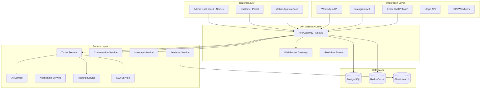

# Ticket Management System Design Document

## Overview

The ticket management system serves as the operational heart of Glavito, providing a unified interface for managing multi-channel customer support tickets. Building upon the existing authentication and onboarding systems, this design leverages the current NestJS/Next.js architecture with Prisma ORM and extends the existing ticket, conversation, and message modules to create a comprehensive, AI-enhanced ticketing platform.

The system integrates seamlessly with existing WhatsApp, Instagram, and Email channels while providing real-time collaboration, intelligent routing, and comprehensive analytics capabilities.

## Architecture

### High-Level Architecture



### Component Architecture

The system extends existing modules and introduces new specialized components:

#### Core Components
- **Enhanced Ticket Module**: Extends existing ticket functionality with AI integration
- **Real-time Collaboration Module**: WebSocket-based real-time features
- **AI Assistant Module**: Machine learning and automation capabilities
- **SLA Management Module**: Service level agreement tracking and enforcement
- **Analytics Module**: Performance metrics and reporting
- **Mobile API Module**: Optimized endpoints for mobile interfaces

#### Integration Components
- **Channel Orchestrator**: Unified message handling across channels
- **Workflow Engine**: Automation and routing logic
- **Notification Hub**: Multi-channel notification delivery
- **Search Engine**: Advanced ticket search and filtering

## Components and Interfaces

### 1. Enhanced Ticket Management Module

#### Ticket Service Extensions
```typescript
interface TicketServiceInterface {
  // Core CRUD operations (existing)
  createTicket(data: CreateTicketDto): Promise<Ticket>
  updateTicket(id: string, data: UpdateTicketDto): Promise<Ticket>
  getTicket(id: string): Promise<TicketWithDetails>
  
  // New enhanced operations
  assignTicket(ticketId: string, agentId: string, assignedBy: string): Promise<TicketAssignment>
  escalateTicket(ticketId: string, escalationData: EscalationDto): Promise<Ticket>
  bulkUpdateTickets(ticketIds: string[], updates: BulkUpdateDto): Promise<Ticket[]>
  getTicketTimeline(ticketId: string): Promise<TicketTimelineEvent[]>
  
  // AI-enhanced operations
  suggestResponses(ticketId: string): Promise<ResponseSuggestion[]>
  classifyTicket(ticketId: string): Promise<TicketClassification>
  analyzeSentiment(ticketId: string): Promise<SentimentAnalysis>
  
  // Search and filtering
  searchTickets(query: SearchTicketsDto): Promise<PaginatedTickets>
  getTicketsByFilter(filter: TicketFilterDto): Promise<PaginatedTickets>
}
```

#### Ticket Controller Extensions
```typescript
@Controller('tickets')
export class TicketsController {
  // Enhanced endpoints
  @Get(':id/timeline')
  getTicketTimeline(@Param('id') id: string): Promise<TicketTimelineEvent[]>
  
  @Post(':id/assign')
  assignTicket(@Param('id') id: string, @Body() assignDto: AssignTicketDto): Promise<TicketAssignment>
  
  @Post(':id/escalate')
  escalateTicket(@Param('id') id: string, @Body() escalationDto: EscalationDto): Promise<Ticket>
  
  @Post('bulk-update')
  bulkUpdateTickets(@Body() bulkUpdateDto: BulkUpdateTicketsDto): Promise<Ticket[]>
  
  @Get('search')
  searchTickets(@Query() searchDto: SearchTicketsDto): Promise<PaginatedTickets>
  
  @Get(':id/ai/suggestions')
  getAISuggestions(@Param('id') id: string): Promise<ResponseSuggestion[]>
}
```

### 2. Real-time Collaboration Module

#### WebSocket Gateway
```typescript
@WebSocketGateway({
  cors: { origin: '*' },
  namespace: 'tickets'
})
export class TicketGateway {
  @SubscribeMessage('join-ticket')
  handleJoinTicket(client: Socket, ticketId: string): void
  
  @SubscribeMessage('leave-ticket')
  handleLeaveTicket(client: Socket, ticketId: string): void
  
  @SubscribeMessage('typing-start')
  handleTypingStart(client: Socket, data: TypingEventDto): void
  
  @SubscribeMessage('typing-stop')
  handleTypingStop(client: Socket, data: TypingEventDto): void
  
  @SubscribeMessage('ticket-update')
  handleTicketUpdate(client: Socket, data: TicketUpdateEventDto): void
}
```

#### Collaboration Service
```typescript
interface CollaborationServiceInterface {
  joinTicket(userId: string, ticketId: string): Promise<void>
  leaveTicket(userId: string, ticketId: string): Promise<void>
  getActiveUsers(ticketId: string): Promise<ActiveUser[]>
  broadcastTyping(ticketId: string, userId: string, isTyping: boolean): Promise<void>
  broadcastTicketUpdate(ticketId: string, update: TicketUpdateEvent): Promise<void>
}
```

### 3. AI Assistant Module

#### AI Service Interface
```typescript
interface AIServiceInterface {
  // Response suggestions
  generateResponseSuggestions(ticketId: string, context: string): Promise<ResponseSuggestion[]>
  
  // Ticket classification
  classifyTicket(content: string, metadata: TicketMetadata): Promise<TicketClassification>
  
  // Sentiment analysis
  analyzeSentiment(content: string): Promise<SentimentAnalysis>
  
  // Knowledge base integration
  findRelevantArticles(query: string, limit: number): Promise<KnowledgeBaseArticle[]>
  
  // Automated responses
  generateAutoResponse(ticketId: string): Promise<AutoResponseResult>
  
  // Priority scoring
  calculatePriority(ticketData: TicketData): Promise<PriorityScore>
}
```

### 4. SLA Management Module

#### SLA Service Interface
```typescript
interface SLAServiceInterface {
  // SLA policy management
  createSLAPolicy(data: CreateSLAPolicyDto): Promise<SLAPolicy>
  updateSLAPolicy(id: string, data: UpdateSLAPolicyDto): Promise<SLAPolicy>
  
  // SLA instance management
  createSLAInstance(ticketId: string, policyId: string): Promise<SLAInstance>
  updateSLAInstance(instanceId: string, data: UpdateSLAInstanceDto): Promise<SLAInstance>
  
  // SLA monitoring
  checkSLACompliance(ticketId: string): Promise<SLAComplianceStatus>
  getUpcomingBreaches(tenantId: string): Promise<SLABreach[]>
  
  // Escalation handling
  triggerEscalation(instanceId: string): Promise<EscalationResult>
  pauseSLA(instanceId: string, reason: string): Promise<void>
  resumeSLA(instanceId: string): Promise<void>
}
```

### 5. Analytics Module

#### Analytics Service Interface
```typescript
interface AnalyticsServiceInterface {
  // Performance metrics
  getAgentPerformance(agentId: string, dateRange: DateRange): Promise<AgentPerformanceMetrics>
  getTeamPerformance(teamId: string, dateRange: DateRange): Promise<TeamPerformanceMetrics>
  
  // Ticket analytics
  getTicketVolumeAnalytics(tenantId: string, dateRange: DateRange): Promise<TicketVolumeAnalytics>
  getResolutionTimeAnalytics(tenantId: string, dateRange: DateRange): Promise<ResolutionTimeAnalytics>
  
  // Channel analytics
  getChannelPerformance(tenantId: string, dateRange: DateRange): Promise<ChannelPerformanceMetrics>
  
  // Customer satisfaction
  getCustomerSatisfactionMetrics(tenantId: string, dateRange: DateRange): Promise<CSATMetrics>
  
  // Real-time dashboard data
  getDashboardMetrics(tenantId: string): Promise<DashboardMetrics>
}
```

## Data Models

### Enhanced Ticket Model Extensions

The existing Prisma schema already includes comprehensive ticket models. The following enhancements will be added:

#### New Models for Ticket Management

```prisma
model TicketTimelineEvent {
  id          String   @id @default(cuid())
  ticketId    String
  userId      String?
  eventType   String   // created, assigned, updated, escalated, resolved, closed
  eventData   Json     @default("{}")
  description String?
  createdAt   DateTime @default(now())
  
  ticket      Ticket   @relation(fields: [ticketId], references: [id], onDelete: Cascade)
  user        User?    @relation(fields: [userId], references: [id])
  
  @@map("ticket_timeline_events")
}

model TicketCollaboration {
  id          String   @id @default(cuid())
  ticketId    String
  userId      String
  action      String   // joined, left, typing_start, typing_stop
  metadata    Json     @default("{}")
  createdAt   DateTime @default(now())
  
  ticket      Ticket   @relation(fields: [ticketId], references: [id], onDelete: Cascade)
  user        User     @relation(fields: [userId], references: [id], onDelete: Cascade)
  
  @@map("ticket_collaborations")
}

model TicketAIAnalysis {
  id              String   @id @default(cuid())
  ticketId        String   @unique
  classification  Json?    // Category, subcategory, confidence scores
  sentiment       Json?    // Sentiment analysis results
  priority        Json?    // AI-calculated priority
  suggestions     Json?    // Response suggestions
  keywords        String[] @default([])
  confidence      Float?
  lastAnalyzed    DateTime @default(now())
  
  ticket          Ticket   @relation(fields: [ticketId], references: [id], onDelete: Cascade)
  
  @@map("ticket_ai_analysis")
}

model TicketSearch {
  id          String   @id @default(cuid())
  ticketId    String   @unique
  searchVector String  // Full-text search vector
  content     String   // Searchable content
  metadata    Json     @default("{}")
  updatedAt   DateTime @updatedAt
  
  ticket      Ticket   @relation(fields: [ticketId], references: [id], onDelete: Cascade)
  
  @@map("ticket_search")
}
```

### Data Transfer Objects (DTOs)

#### Core Ticket DTOs
```typescript
export class CreateTicketDto {
  customerId: string
  channelId: string
  subject: string
  description: string
  priority?: string
  tags?: string[]
  customFields?: Record<string, any>
}

export class UpdateTicketDto {
  subject?: string
  description?: string
  status?: string
  priority?: string
  assignedAgentId?: string
  tags?: string[]
  customFields?: Record<string, any>
}

export class SearchTicketsDto {
  query?: string
  status?: string[]
  priority?: string[]
  assignedAgentId?: string
  channelId?: string
  customerId?: string
  dateRange?: {
    start: Date
    end: Date
  }
  tags?: string[]
  page?: number
  limit?: number
  sortBy?: string
  sortOrder?: 'asc' | 'desc'
}

export class BulkUpdateTicketsDto {
  ticketIds: string[]
  updates: {
    status?: string
    priority?: string
    assignedAgentId?: string
    tags?: string[]
  }
}
```

#### AI and Analytics DTOs
```typescript
export class ResponseSuggestion {
  id: string
  content: string
  confidence: number
  type: 'template' | 'ai_generated' | 'knowledge_base'
  source?: string
}

export class TicketClassification {
  category: string
  subcategory?: string
  confidence: number
  keywords: string[]
  suggestedPriority: string
}

export class SentimentAnalysis {
  sentiment: 'positive' | 'negative' | 'neutral'
  confidence: number
  emotions: {
    anger: number
    frustration: number
    satisfaction: number
    urgency: number
  }
}
```

## Error Handling

### Custom Exception Classes
```typescript
export class TicketNotFoundException extends NotFoundException {
  constructor(ticketId: string) {
    super(`Ticket with ID ${ticketId} not found`)
  }
}

export class TicketAssignmentException extends BadRequestException {
  constructor(message: string) {
    super(`Ticket assignment failed: ${message}`)
  }
}

export class SLAViolationException extends ConflictException {
  constructor(ticketId: string, violation: string) {
    super(`SLA violation for ticket ${ticketId}: ${violation}`)
  }
}

export class AIServiceException extends ServiceUnavailableException {
  constructor(operation: string) {
    super(`AI service unavailable for operation: ${operation}`)
  }
}
```

### Error Response Format
```typescript
interface ErrorResponse {
  statusCode: number
  message: string
  error: string
  timestamp: string
  path: string
  details?: Record<string, any>
}
```

## Testing Strategy

### Unit Testing
- **Service Layer Testing**: Comprehensive unit tests for all service methods
- **Controller Testing**: API endpoint testing with mocked services
- **AI Integration Testing**: Mock AI services for consistent testing
- **WebSocket Testing**: Real-time functionality testing

### Integration Testing
- **Database Integration**: Prisma model and query testing
- **External API Integration**: WhatsApp, Instagram, Email API testing
- **Cache Integration**: Redis caching functionality testing
- **Search Integration**: Elasticsearch integration testing

### End-to-End Testing
- **Complete Ticket Lifecycle**: From creation to resolution
- **Multi-channel Flow**: Cross-channel ticket management
- **Real-time Collaboration**: WebSocket communication testing
- **SLA Compliance**: Time-based SLA testing

### Performance Testing
- **Load Testing**: High-volume ticket processing
- **Concurrent User Testing**: Multiple agents working simultaneously
- **Database Performance**: Query optimization and indexing
- **Real-time Performance**: WebSocket connection limits

## Security Considerations

### Authentication and Authorization
- **JWT Token Validation**: Secure API access
- **Role-based Access Control**: Agent, admin, supervisor permissions
- **Tenant Isolation**: Multi-tenant data security
- **API Rate Limiting**: Prevent abuse and ensure fair usage

### Data Protection
- **Sensitive Data Encryption**: Customer information protection
- **Audit Logging**: Complete action tracking
- **Data Retention Policies**: Automated data lifecycle management
- **GDPR Compliance**: Customer data rights and privacy

### API Security
- **Input Validation**: Comprehensive DTO validation
- **SQL Injection Prevention**: Prisma ORM protection
- **XSS Protection**: Frontend input sanitization
- **CORS Configuration**: Secure cross-origin requests

## Performance Optimization

### Database Optimization
- **Indexing Strategy**: Optimized queries for ticket search and filtering
- **Connection Pooling**: Efficient database connection management
- **Query Optimization**: Prisma query performance tuning
- **Data Archiving**: Automated old ticket archiving

### Caching Strategy
- **Redis Caching**: Frequently accessed ticket data
- **Search Result Caching**: Elasticsearch query caching
- **Session Caching**: User session and preference caching
- **AI Response Caching**: Machine learning result caching

### Real-time Performance
- **WebSocket Optimization**: Efficient connection management
- **Event Batching**: Grouped real-time updates
- **Connection Scaling**: Horizontal WebSocket scaling
- **Memory Management**: Efficient real-time data handling

## Deployment and Scalability

### Microservice Architecture
- **Service Separation**: Independent ticket management services
- **API Gateway**: Centralized request routing and authentication
- **Load Balancing**: Distributed request handling
- **Service Discovery**: Dynamic service registration

### Horizontal Scaling
- **Database Sharding**: Tenant-based data distribution
- **Cache Clustering**: Redis cluster configuration
- **WebSocket Scaling**: Socket.io adapter for multiple instances
- **Search Scaling**: Elasticsearch cluster management

### Monitoring and Observability
- **Application Metrics**: Performance and usage tracking
- **Error Monitoring**: Comprehensive error tracking and alerting
- **Real-time Dashboards**: System health monitoring
- **Log Aggregation**: Centralized logging and analysis

This design provides a comprehensive foundation for implementing the ticket management system while leveraging your existing architecture and ensuring scalability, security, and performance.